# id_generator

This project is a Flutter-based Android application designed to streamline and enhance the management of college events. It provides a comprehensive platform for students and administrators to stay informed about upcoming events, register for participation, and manage event-related tasks efficiently.

## Features

**For Students:**

- **User-Friendly Event Browsing:** Explore a curated list of upcoming events, complete with dates, times, locations, and detailed descriptions.
- **Effortless Event Registration:**  Register for events seamlessly within the app, receive confirmation, and access digital tickets.
- **Personalized Event Feed:**  View a tailored feed of registered events, ensuring you never miss an important update. 
- **QR Code-Based Attendance:**  Conveniently check-in at events using unique QR codes generated for each registration.
- **Profile Management:** Maintain a detailed profile with personal and academic information.

**For Admins:**

- **Intuitive Event Creation:** Easily create and publish new events with comprehensive details. 
- **Date and Time Scheduling:**  Set specific dates and times for events using an interactive calendar interface.
- **Participant Management:** View a list of participants for each event, track attendance, and manage registrations.
- **Student Verification:**  Verify student profiles to maintain data accuracy and manage access levels. 

**Additional Highlights:**

- **Secure Login System:**  Ensures user privacy and data security through phone number-based authentication.
- **Clean and Modern UI:** An intuitive and visually appealing user interface for a seamless user experience.
- **Efficient Database Integration:**  Leverages a backend database (Firebase is recommended) for real-time data synchronization and storage.

# Feature Added 
- [X] Splash Screen
- [x] Login Screen
- [x] Register Screen
- [x] Home Screen
- [x] Profile Screen
- [x] StudentHome
- [x] Verify Phone Number Screen 
- [x] OTP functionality For Phone Authentication
- [x] Event Generate UI with functionality 
- [x] Event View & Delete UI with functionality  
- [x] Admin Home Screen
- [x] Create Event Screen with Generating Event Functionality 
- [x] View Event Screen with Fetching Event Functionality 

## Student/Participant

| | | | |
|-|-|-|-|
|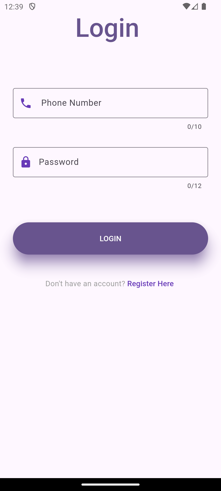|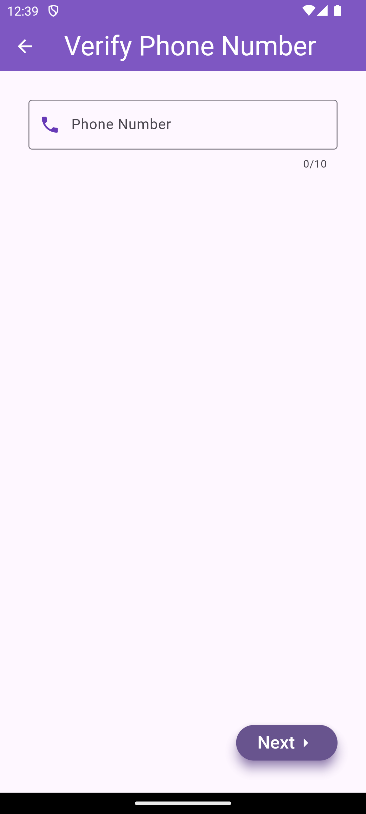|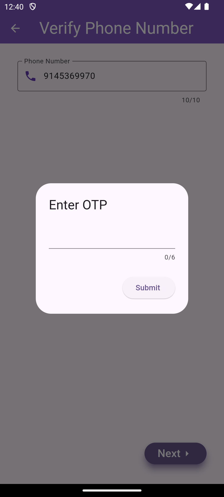|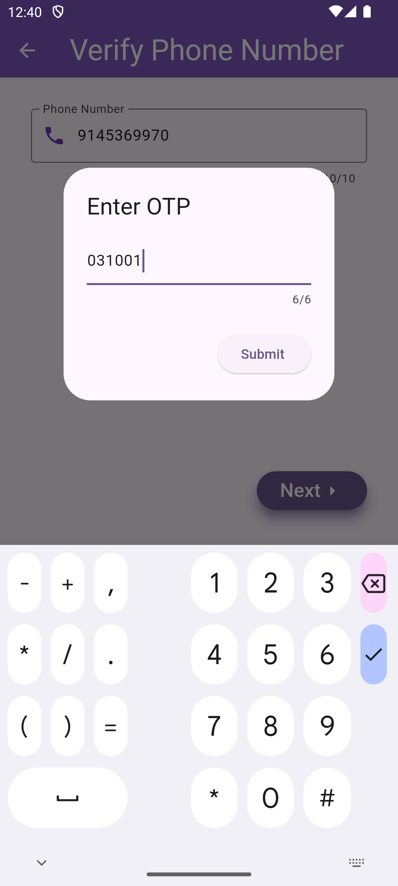|
|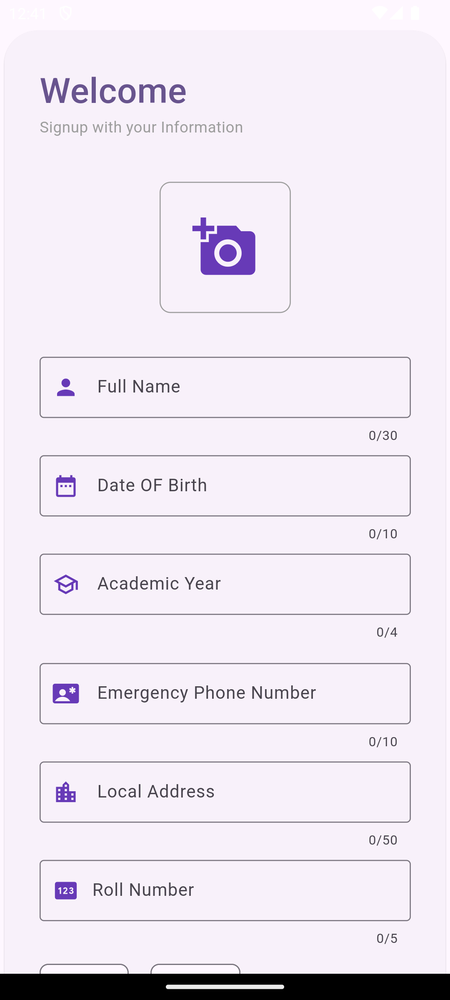|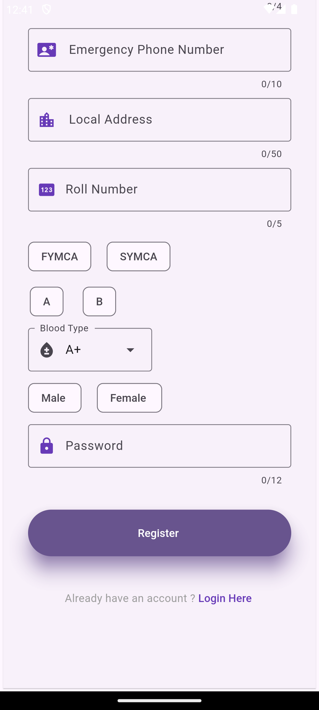|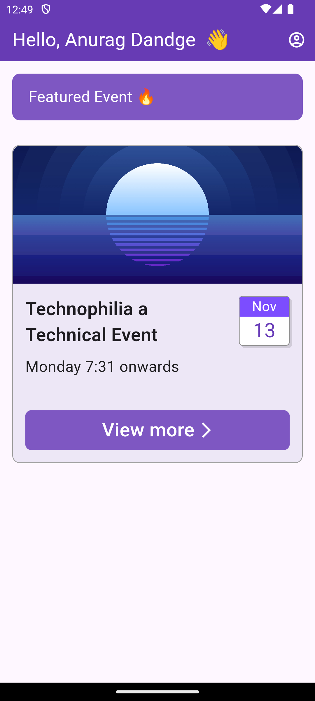|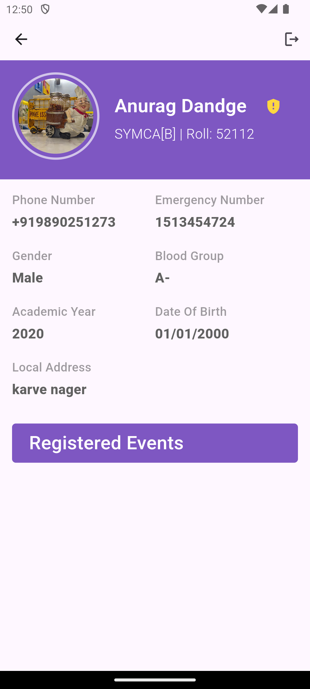|
|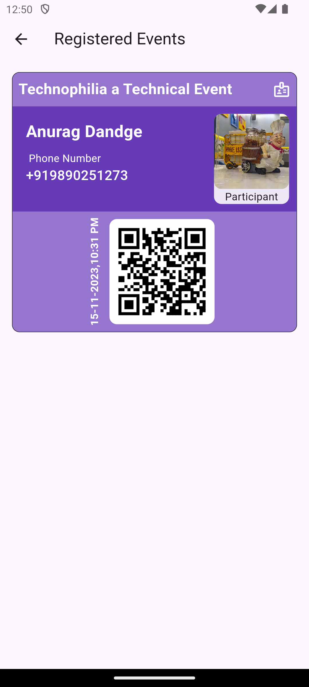|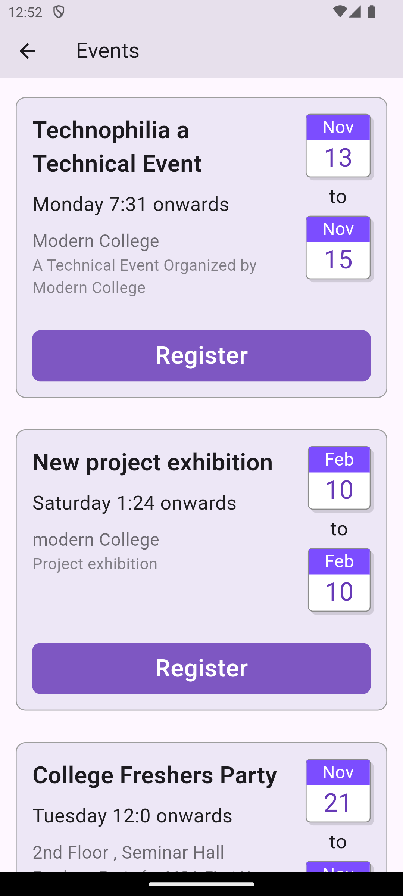|

## Admin

| | | | |
|-|-|-|-|
|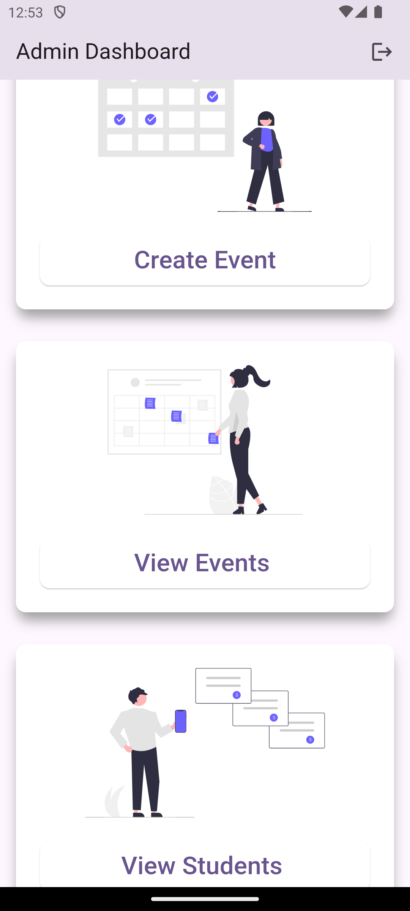|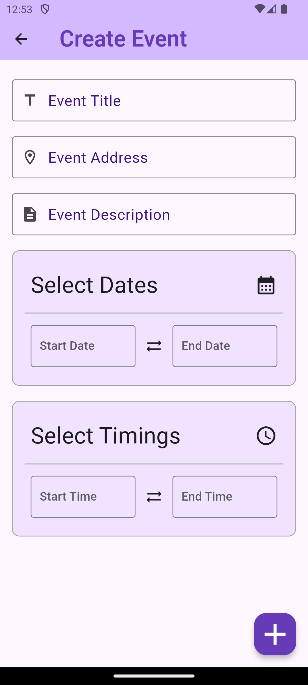|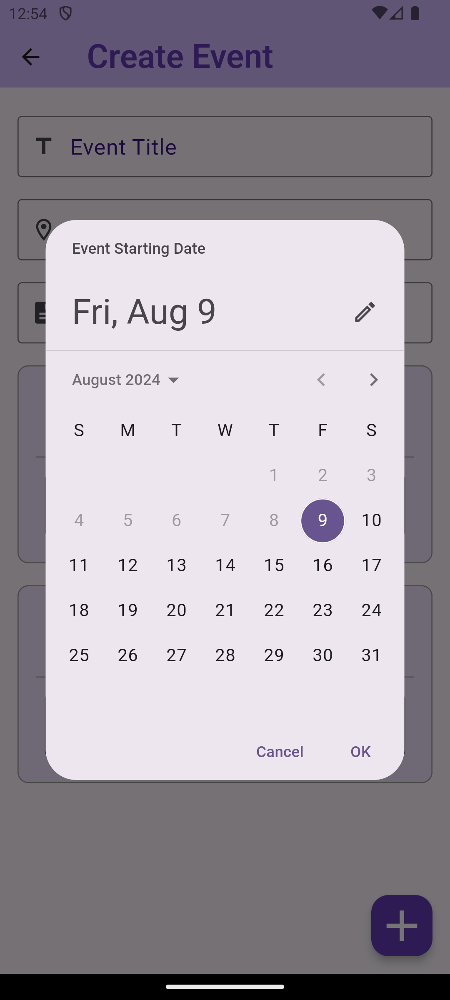|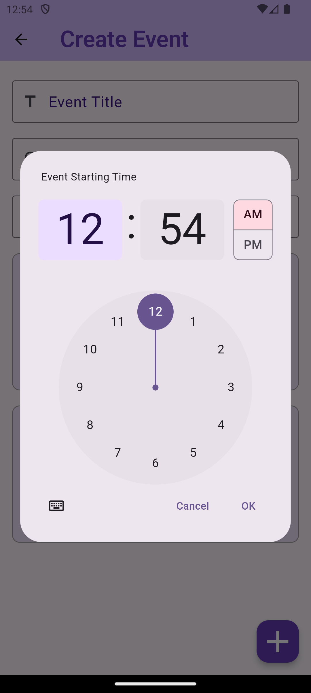|
|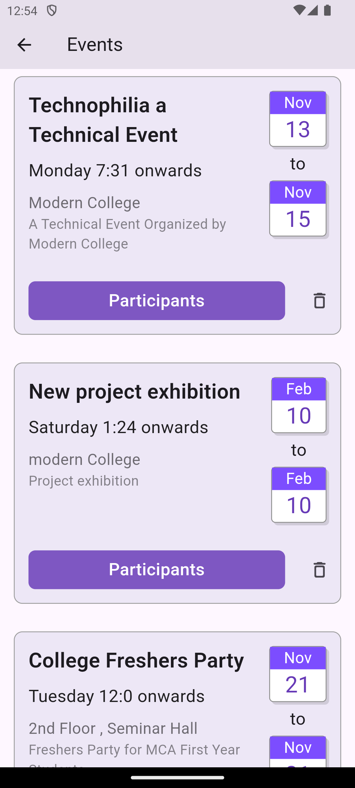|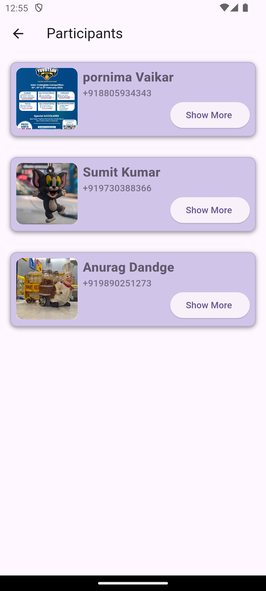|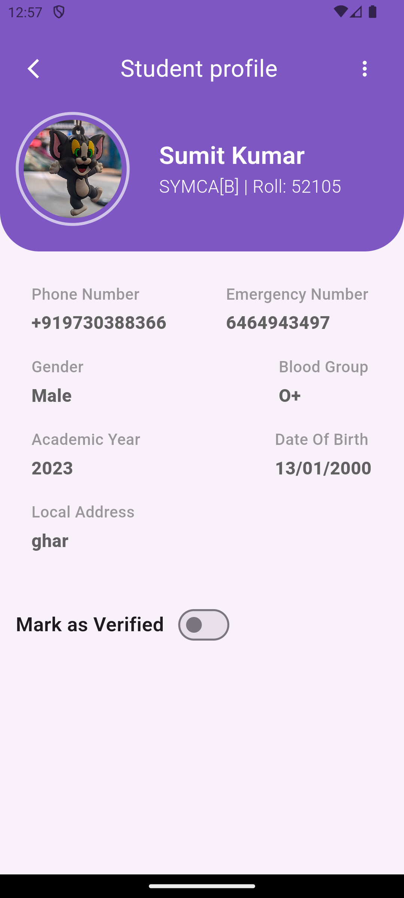| 
